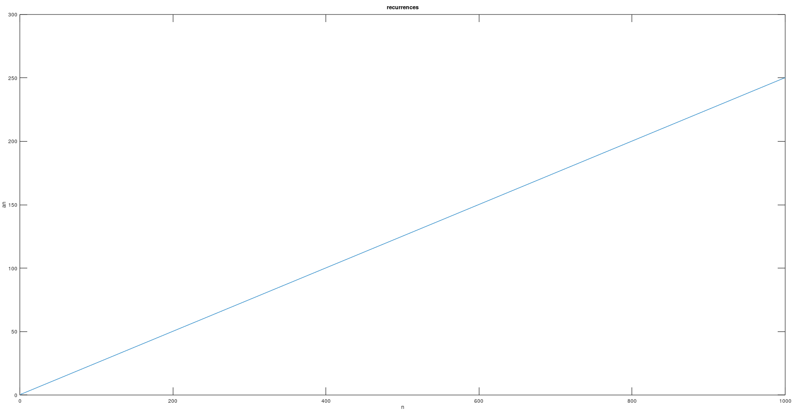
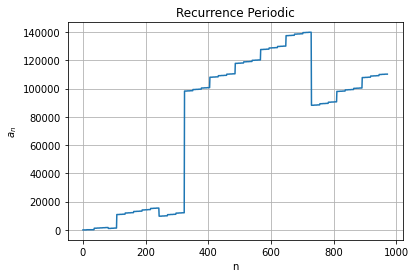

# Analysis of Algorithms

## Project Description

In short, in computer science, analysis of algorithms is the process of figuring out the computational complexity of algorithms - the amount of time, storage or other resources required to execute them. In this repository, the solutions of the problems given in the Analysis of Algorithms course will be shown. Problems will be solved through various programming languages. Please indicate if there are any missing, incorrect or excess parts.

## Recurrences

**1 - Suppose that $an_n = (n - 3) a_{n-1} + n$ for $n > 2$ with $a_0 = a_1 = a_2 = 0$. What is the value of $a_{999}$?**

Solution of the problem on Java:

	public class Programme {

	    public static void main(String[] args) {
	    
		int tam = 1000, n;
		float[] an = new float[tam];
		an[0] = 0;
		an[1] = 0;
		an[2] = 0;

		for (n = 3; n < tam; n++) {
		   an[n] = (((n - 3) * an[n - 1]) / n) + 1;
		   System.out.println(an[n]);
		}
			
	    }

	}

Console output:

**250**

 

Solution of the problem on Python 3.9:

	import numpy as np

	tam = 1000
	n = 3
	an=np.zeros(tam)
	an[0] = 0
	an[1] = 0
	an[2] = 0

	while n < tam:
	    an[n] = (((n - 3) * an[n - 1]) / n) + 1
	    print(an[n])
	    n+=1
	    
	print(f"Answer of the question : {an[999]}")

Console output:

**Answer of the question : 250.0**

 

Solution of the problem on MATLAB:

	tam = 1000;
	n = 2;
	an = zeros(tam, 1);
	an(1) = 0;
	an(2) = 0;
	an(3) = 0;

	while n <= tam
	  an(n) = ((((n-3) * an(n-1))/ n) + 1);
	  n=n+1;
	end

	plot(an)
	xlabel('n');
	ylabel('an');
	title('recurrences');

	an(999)

Console output:

**250**

	

 

 

**2 - Plot the periodic part of the solution to the recurrence $a_n = 3a_{[N/3]} + N$ for $N > 3$ with $a_1 = a_2 = a_3 = 1$ for $1 \leq N \leq972$.**

Solution of the problem on Java (it does not include plotting):

    public class Programme {
    
        public static void main(String[] args) {
        
        	int tam = 972, n;
    		float[] an = new float[tam];
    		an[0] = 1;
    		an[1] = 1;
    		an[2] = 1;
    
    		for (n=4; n < tam; n++) {	        
    			an[n] = (9 * an[n / 3]) + n;        
    		}
    		for (n=0; n < tam; n++)	{
    			System.out.println("a["+n+"] = " + an[n]);
    		}
        }    
    }

Console output:

**a[971] = 110231.0** 

 

Solution of the problem on Python 3.9:

    import numpy as np
    
    tam = 972
    n = 4
    an=np.zeros(tam)
    
    an[0] = 1
    an[1] = 1
    an[2] = 1
    
    while n < tam:
        an[n] = (9 * an[n // 3]) + n
        n+=1
    
    tam = 972
    n = 0 
    an_arr = []
    while n < tam:
        if n >= 0 and n <=972:
            print(f"a[{n}] = ", an[n])
            an_arr.append(an[n])
        n+=1
    
    import matplotlib.pyplot as plt
    plt.plot(an_arr)
    plt.grid()
    plt.xlabel('n')
    plt.ylabel('$a_n$')
    plt.title('Recurrence Periodic')
    plt.savefig('recurrence_periodic.png')
    plt.show()

Console output:

**a[971] =  110231.0**

	

 

 

## Generating Functions

**Suppose that $a_n = 9a_{n-1} - 20a_{n-2}$ for $n > 1$ with $a_0 = 0$ and $a_1 = 1$. What is the value of $\lim_{n \to \infty} \dfrac{a_n }{a_{n-1}}$?**

Solution of the problem on Java:

	public class Programme {

		public static void main(String[] args) {

			int tam = 100, n;
			float[] an = new float[tam];
			float aux;
			an[0] = 0;
			an[1] = 1;

			for (n = 2; n < tam; n++)   {	        
				an[n] = (9 * an[n - 1]) - (20 * an[n - 2]);

				if (n>=2 && n <= 100)	{
					System.out.println("a["+n+"] = " + an[n]);
				}	        
			}

			for (n = 2; n < tam; n++)   {	        
				aux=(float)an[n]/an[n-1];

				if (n>=2 && n <= 100)	{
					System.out.println("aux["+n+"] = " + aux);
				}	        
		    	}
		
		}
	}

Console output:

**aux[99] =  5.000000000318287** which is $\approx$ 5.

 

Solution of the problem on Python 3.9:

	import numpy as np

	tam = 100
	n = 2
	an=np.zeros(tam)

	an[0] = 0
	an[1] = 1

	while n < tam:
	    an[n] = (9 * an[n - 1]) - (20 * an[n - 2])
	    if n >= 2 and n <=100:
	        print(f"a[{n}] = ", an[n])
	    n+=1

	print("\n ====== \n")

	tam = 100
	n = 2 
	while n < tam:
	    aux = an[n]/an[n - 1]
	    aux = float(aux)
	    if n >= 2 and n <= 100:
	        print(f"aux[{n}] = ", aux)
	    n+=1

Console output:

**aux[99] =  5.000000000318287** which is $\approx$ 5.

 

Solution of the problem on MATLAB:

	format long
	tam = 100;
	n = 3;
	an = zeros(tam, 1);
	an(1) = 0;
	an(2) = 1;

	while n <= tam
	  an(n) = (9 * an(n-1)) - (20 * an(n-2))
	  n=n+1;
	end

	tam = 100;
	n = 3;
	while n <= tam
	  aux = an(n)/an(n-1)
	  n=n+1;
	end

Console output:

**aux[100] =  5.000000000318287** which is $\approx$ 5.

## Contact Me

If you have something to say to me please contact me: 

 - Twitter: [Doguilmak](https://twitter.com/Doguilmak)  
 - Mail address: doguilmak@gmail.com
 
